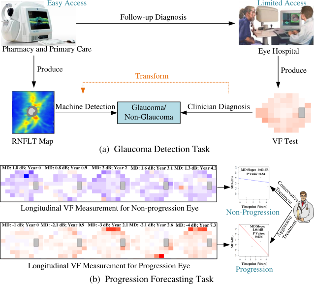

# Harvard-GDP

The dataset and code for the paper entitled [**Harvard Glaucoma Detection and Progression: A Multimodal Multitask Dataset and Generalization-Reinforced Semi-Supervised Learning**](https://openaccess.thecvf.com/content/ICCV2023/papers/Luo_Harvard_Glaucoma_Detection_and_Progression_A_Multimodal_Multitask_Dataset_and_ICCV_2023_paper.pdf). The abbreviation of our dataset is **Harvard-GDP**, which stands for Harvard Glaucoma Detection and Progression. Note that, the modifier word “Harvard” only indicates that our dataset is from the Department of Ophthalmology of Harvard Medical School and does not imply an endorsement, sponsorship, or assumption of responsibility by either Harvard University or Harvard Medical School as a legal identity.

# Dataset

The dataset can be accessed via this [link](https://drive.google.com/drive/folders/1JMi_HCql113uc9X0DOaMkNfEWfxaDlEz?usp=drive_link). This dataset can only be used for non-commercial research purposes. At no time, the dataset shall be used for clinical decisions or patient care. The data use license is [CC BY-NC-ND 4.0](https://creativecommons.org/licenses/by-nc-nd/4.0/). The data use license is [CC BY-NC-ND 4.0](https://creativecommons.org/licenses/by-nc-nd/4.0/). If you have any questions about this dataset, please email <harvardophai@gmail.com>.

The glaucoma data of 1,000 patients includes 1,000 OCT RNFLT maps (dimension 225 x 225). The visual field, patient age, gender, race, glaucoma, and progression label information are also included in the data.

1,000 OCT RNFLT maps are in the rnflt_maps folder:
data_0001.npz
data_0002.npz
...
data_1000.npz

Each data contains the following attributes:
1) rnflt: OCT RNFLT map of size 225 x 225.
2) glaucoma: glaucomatous status, 0 for non-glaucoma and 1 for glaucoma.
3) progression: a vector corresponding to 6 different progression labels, 0 for non-progression and 1 for progression.
4) md: mean deviation value of visual field.
5) tds: 52 total deviation values of visual field.
6) age: patient age.
7) male: patient gender, 0 for female and 1 for male.
8) race: patient race.
9) hispanic: patient ethnicity

Only the first 500 data (0001~0500) have progression label defined in 6 ways respectively:
progression[0]: md.
progression[1]: vfi.
progression[2]: td_pointwise.
progression[3]: md_fast.
progression[4]: md_fast_no_p_cut.
progression[5]: td_pointwise_no_p_cut.


# Abstract

<p align="center">

</p>

Glaucoma is the number one cause of irreversible blindness globally. A major challenge for accurate glaucoma detection and progression forecasting is the bottleneck of limited labeled patients with the state-of-the-art (SOTA) 3D retinal imaging data of optical coherence tomography (OCT). To address the data scarcity issue, this paper proposes two solutions. First, we develop a novel generalization-reinforced semi-supervised learning (SSL) model called pseudo supervisor to optimally utilize unlabeled data. Compared with SOTA models, the proposed pseudo supervisor optimizes the policy of predicting pseudo labels with unlabeled samples to improve empirical generalization. Our pseudo supervisor model is evaluated with two clinical tasks consisting of glaucoma detection and progression forecasting. The progression forecasting task is evaluated both unimodally and multimodally. Our pseudo supervisor model demonstrates superior performance than SOTA SSL comparison models. Moreover, our model also achieves the best results on the publicly available LAG fundus dataset.  Second, we introduce the Harvard Glaucoma Detection and Progression (Harvard-GDP) Dataset, a multimodal multitask dataset that includes data from 1,000 patients with OCT imaging data, as well as labels for glaucoma detection and progression. This is the largest glaucoma detection dataset with 3D OCT imaging data and the first glaucoma progression forecasting dataset that is publicly available. Detailed sex and racial analysis are provided, which can be used by interested researchers for fairness learning studies. Our released dataset is benchmarked with several SOTA supervised CNN and transformer deep learning models.

# Requirements

To install the prerequisites, run:

```
pip install - r requirements.txt
```

# Experiments

To run the experiments on the task of glaucoma detection, run:

```
./glaucoma_detection_training.sh
```

To run the experiments on the task of progression forecasting, run:

```
./progression_forecasting_training.sh
```

## Acknowledgement and Citation


If you find this repository useful for your research, please consider citing our [paper](https://openaccess.thecvf.com/content/ICCV2023/papers/Luo_Harvard_Glaucoma_Detection_and_Progression_A_Multimodal_Multitask_Dataset_and_ICCV_2023_paper.pdf):

```bibtex
@inproceedings{luo2023harvard,
  title={Harvard Glaucoma Detection and Progression: A Multimodal Multitask Dataset and Generalization-Reinforced Semi-Supervised Learning},
  author={Luo, Yan and Shi, Min and Tian, Yu and Elze, Tobias and Wang, Mengyu},
  booktitle={Proceedings of the IEEE/CVF International Conference on Computer Vision},
  pages={20471--20482},
  year={2023}
}
}
